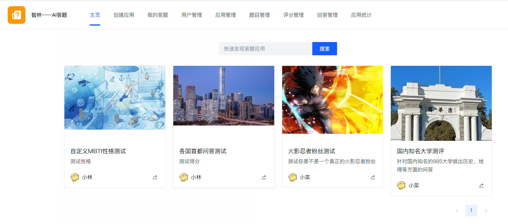
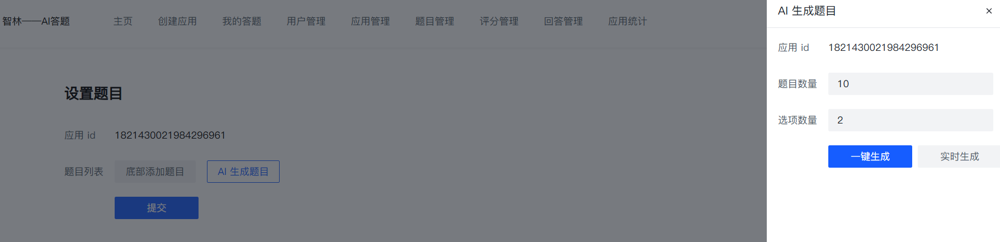
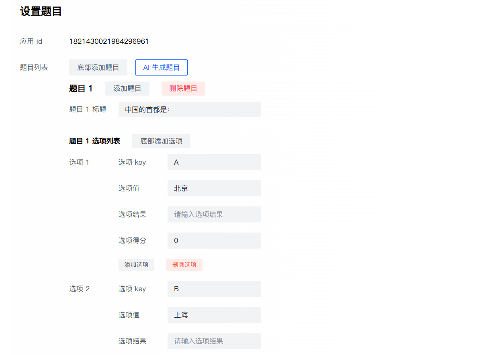
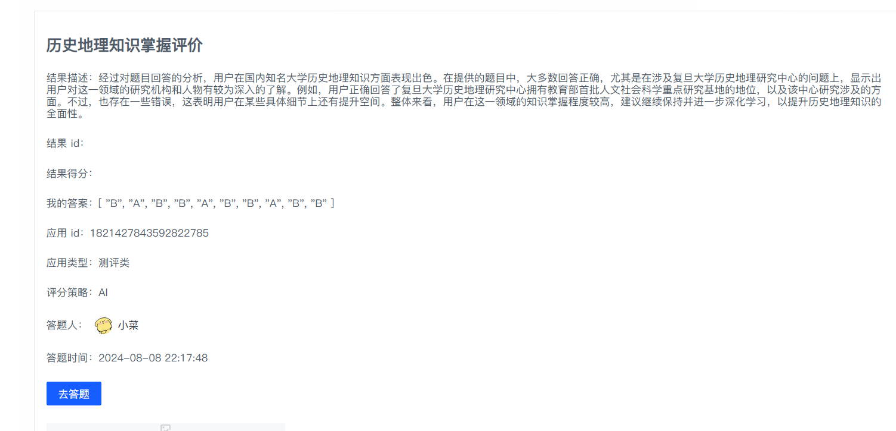
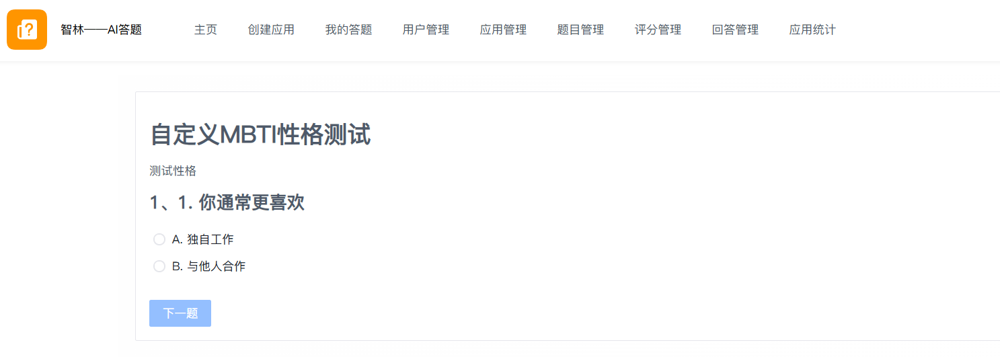
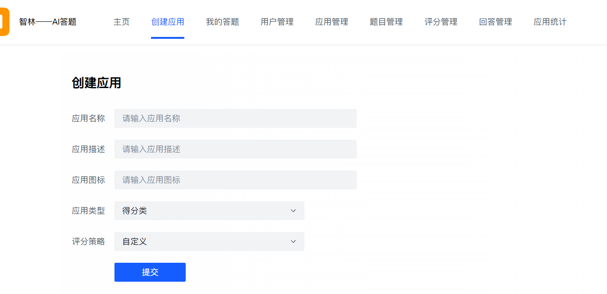
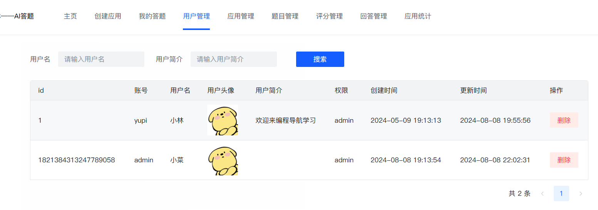
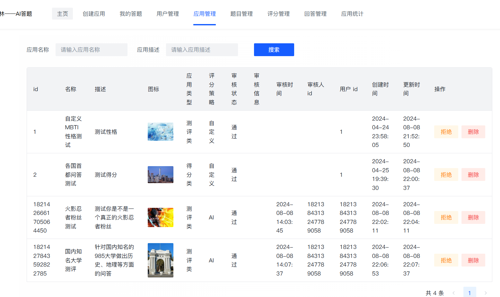
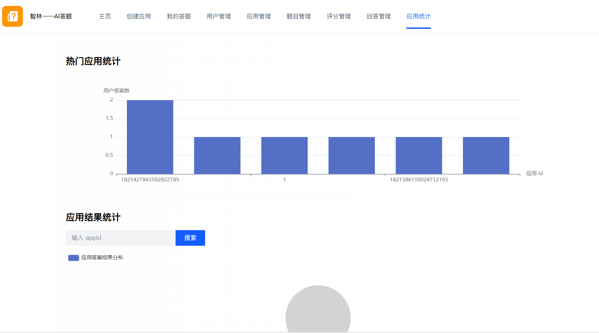

# 智林 - AI 答题应用平台

## 一、项目介绍

智林AI答题是一款基于 Vue 3 + Spring Boot + Redis + ChatGLM + RxJava + SSE 的 **AI 答题应用平台。**

用户可以基于 AI 快速制作并发布答题应用，支持检索、分享、在线答题并基于 AI 得到回答总结；管理员可以集中管理和审核应用。

什么是答题应用？

我相信很多朋友都做过 MBTI 性格测试，相当于一份试卷里有很多道题目，大家根据题目选择选项，最终提交答案并得到性格分析结果。

这还不够：

本项目用到了当今最流行的 AI 应用开发，打造 `AI 答题应用平台`。用户可以基于 AI 快速创建答题应用、并基于 AI 分析总结用户的答案。

#### AI生成题目：

#### AI评分：

除了这些核心功能，项目中还提供了很多的基础功能，如用户登录，用户创建应用，手动创建题目，应用统计和管理（仅管理员）等

## 二、系统架构与核心业务流程

如下图：

.jpg)

时序图：

## 三、项目功能梳理

### 小程序

- 在线答题

### 平台

- 用户模块

- - 注册
  - 登录
  - 管理用户 - 增删改查（仅管理员可用）

- 应用模块

- - 创建应用（名称、描述、上传图片、应用类型）
  - 修改应用（用户）
  - 审核发布和下架应用（管理员）
  - 管理应用 - 增删改查（管理员）
  - 应用分享（扫码查看）

- 题目模块

- - 创建题目（名称、选项）
  - 修改题目
  - 删除题目
  - AI 生成题目

- 评分模块

- - 多种评分策略
  - 创建评分结果
  - 题目得分设置

- 回答模块

- - 提交选择
  - 回答记录
  - AI 分析总结回答

- 统计分析模块

- - 应用评分结果分析

## 技术选型

### 开发工具

- 前端 IDE：JetBrains WebStorm
- 后端 IDE：JetBrains IDEA
- [CodeGeeX 智能编程助手](https://codegeex.cn/)

### 前端

#### Web 网页开发

- Vue 3 
- Vue-CLI 脚手架
- Pinia 状态管理
- Axios 请求库
- Arco Design 组件库
- 前端工程化：ESLint + Prettier + TypeScript
- 富文本编辑器
- QRCode.js 二维码生成
- ⭐️ OpenAPI 前端代码生成

#### 小程序开发

- React
- Taro 跨端开发框架
- Taro UI 组件库

### 后端

- Java Spring Boot 开发框架（万用后端模板）
- 存储层：MySQL 数据库 + Redis 缓存 + 腾讯云 COS 对象存储
- MyBatis-Plus 及 MyBatis X 自动生成
- Redission 分布式锁
- Caffeine 本地缓存
- ⭐️ 基于 ChatGLM 大模型实现 AI 能力
- ⭐️ RxJava 响应式框架 + 多线程 / 线程池实战 
- ⭐️ Shardingsphere 分库分表 + 分布式 ID 雪花算法
- ⭐️ SSE 服务端推送
- ⭐️ 多种设计模式
- ⭐️ 多角度项目优化：性能、稳定性、幂等性优化等

## 架构设计

